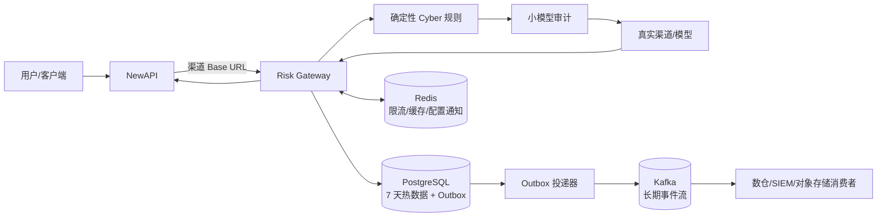

# NewAPI Risk Gateway

面向 **NewAPI → 渠道/模型供应商** 链路的独立风控网关。它不侵入 NewAPI 核心代码：在 NewAPI 的渠道 `Base URL` 与真实供应商之间完成请求审计、渠道错误归一化、用户请求追踪、7 天热数据检索，以及 Redis/Kafka 分布式数据链路。

> 当前版本是可部署、可扩展的生产基线，不等同于“开箱即满足所有行业合规认证”。上线前仍应按业务所在国家/地区完成隐私、内容安全、审计留存和渗透测试评审。

## 能力概览

- **OpenAI 兼容透明代理**：支持 `/v1/chat/completions`、`/v1/responses`、`/v1/embeddings` 以及其他 `/v1/*` 路径；保留 SSE 流式响应。
- **双层 Cyber 审计**：确定性规则先行，默认再调用 OpenAI 兼容小模型；明显的凭据窃取、钓鱼、恶意软件、规避检测、未授权利用、破坏、DDoS/僵尸网络、数据外传等操作型请求返回 `555`。
- **渠道错误统一**：按 HTTP 状态、响应结构和可配置特征词将渠道/模型错误统一为 `HTTP 555 + error.code=555`。
- **请求追踪**：代理请求自动记录；NewAPI 也可调用 `/api/v1/track` 上报用户、渠道、Token、模型、用量和耗时。
- **7 天热窗口**：PostgreSQL 按天分区，默认只保留 7 天可检索记录；后台可修改。
- **分布式链路**：Redis 用于分布式限流、审计缓存和配置失效通知；Kafka 用于审计事件流与可配置长期保留。
- **可靠投递**：先写 PostgreSQL Outbox，再异步投递 Kafka，提供重试、死信 Topic 和全局唯一 `event_id`，语义为至少一次投递。
- **可视化管理台**：路由、模型审计、阈值、留存、错误归一化、速率限制、请求查询和存储健康状态。
- **商业化运行基础**：严格启动校验、SSRF 防护、密钥加密、日志脱敏、健康探针、Prometheus、Grafana、HA Helm、PDB/HPA、优雅退出和端到端回归。

## 链路



## 返回 555 的语义

普通 JSON 请求被规则/模型拦截，或渠道错误命中归一化策略时：

```http
HTTP/1.1 555 Risk Control
Content-Type: application/json
X-Request-ID: req_...
X-Trace-ID: trace_...
```

```json
{
  "error": {
    "message": "Request blocked by cyber risk policy",
    "type": "risk_control_error",
    "param": null,
    "code": 555
  },
  "request_id": "req_...",
  "trace_id": "trace_..."
}
```

`555` 是本平台的业务状态码，不是 IANA 标准状态码。部分 CDN、WAF、SDK 或 APM 可能不接受非标准状态码；这种环境可在外围代理将 HTTP 状态映射为 `403/502`，但保留 JSON 中的 `error.code=555`。

**SSE 特例**：流式响应一旦发送了 HTTP 响应头，HTTP 状态无法再改为 555。若渠道随后在流内返回错误，网关会注入 `event: error` / `data: {"error":{"code":555...}}`，并把追踪记录标记为 `normalized_to_555=true`。

## 5 分钟本地全家桶

要求：Linux、Docker Engine、Docker Compose v2，建议至少 8 GB 内存；小模型是否需要 GPU 取决于模型和吞吐目标。

```bash
cp .env.example .env.example.local
./scripts/generate-env.sh .env .env.example
# 编辑 .env，至少填写真实 DEFAULT_UPSTREAM_BASE_URL；本机私网渠道需同时允许私网目标
vi .env
./scripts/bootstrap-local.sh
```

默认启动：

| 服务 | 监听地址 | 用途 |
|---|---|---|
| Gateway | `0.0.0.0:8088` | 代理/API/管理台 |
| PostgreSQL | `127.0.0.1:5432` | 热数据与 Outbox |
| Redis | `127.0.0.1:6379` | 限流/缓存/通知 |
| Kafka | `127.0.0.1:9092` | 长期事件流 |
| Ollama | `127.0.0.1:11434` | 默认小模型审计 |

管理台：`http://服务器IP:8088/admin/`。登录 Token 为 `.env` 中的 `ADMIN_TOKEN`。

健康检查：

```bash
./scripts/healthcheck.sh
./scripts/newapi-smoke-test.sh http://127.0.0.1:8088/r/default REAL_PROVIDER_KEY
```

## 远端 PostgreSQL / Redis / Kafka

```bash
cp .env.remote.example .env.remote
chmod 600 .env.remote
vi .env.remote

# 远端 Kafka 管理员先创建并设置 Topic（支持 SASL/TLS client.properties）
export KAFKA_BOOTSTRAP='kafka-1:9093,kafka-2:9093,kafka-3:9093'
export KAFKA_COMMAND_CONFIG=/secure/client.properties
export KAFKA_TOPIC_PARTITIONS=24
export KAFKA_REPLICATION_FACTOR=3
export KAFKA_RETENTION_DAYS=365
./scripts/init-kafka-remote.sh

./scripts/bootstrap-remote.sh
```

业务代码不区分本地/远端：只通过 `DATABASE_URL`、`REDIS_URL`、`KAFKA_BROKERS` 与 SASL/TLS 参数切换。完整说明见 [部署手册](docs/DEPLOYMENT.md)。

## 接入 NewAPI

为每个真实供应商建立一个网关路由，例如路由键为 `openai-prod`，上游为 `https://api.openai.com`。然后把 NewAPI 对应渠道的 Base URL 改为：

```text
https://risk.example.com/r/openai-prod
```

NewAPI 请求 `/v1/chat/completions` 时，网关最终请求：

```text
https://api.openai.com/v1/chat/completions
```

`passthrough` 模式保留 NewAPI 发送的 `Authorization`；`managed` 模式由网关保存并替换渠道密钥；`none` 会删除 Authorization。详细字段和推荐标头见 [NewAPI 接入手册](docs/NEWAPI_INTEGRATION.md)。

## NewAPI 主动上报追踪

```bash
curl -X POST 'https://risk.example.com/api/v1/track' \
  -H "Authorization: Bearer $TRACKING_TOKEN" \
  -H 'Content-Type: application/json' \
  --data '{
    "request_id":"newapi-log-123",
    "trace_id":"trace-123",
    "event":"finish",
    "user_id":"42",
    "token_id":"token-9",
    "channel_id":"channel-3",
    "route_key":"openai-prod",
    "model":"gpt-example",
    "http_status":200,
    "upstream_status":200,
    "latency_ms":850,
    "prompt_tokens":100,
    "completion_tokens":50,
    "total_tokens":150,
    "metadata":{"group":"vip"}
  }'
```

`user_id`、`token_id` 和客户端 IP 默认只保存 HMAC-SHA256 哈希，不保存原值。接口定义见 [OpenAPI](docs/openapi.yaml) 和 [事件协议](docs/EVENT_SCHEMA.md)。

## 数据职责

| 组件 | 默认职责 | 失败时行为 |
|---|---|---|
| PostgreSQL | 7 天可检索热数据、路由/设置、Kafka Outbox | 必需；不可用时 readiness 失败 |
| Redis | 分布式令牌桶、模型审计缓存、多实例配置通知 | 可配置为必需；非必需时退化为单实例限流 |
| Kafka | 审计/追踪长期事件流、下游数仓/SIEM 接口 | 事件留在 PostgreSQL Outbox，恢复后续投 |
| 小模型 | 对规则未硬拦截的文本请求做语义审计 | `rules_only` 默认回退规则；也可 fail-open/fail-closed |

Kafka 长期保留适合事件流与回放，但不替代合规归档。需要多年不可变留存时，使用 `event_id` 做幂等键，把 Topic 消费到对象存储、ClickHouse/SIEM 或数据湖。

## 常用命令

```bash
./scripts/deploy.sh local-up
./scripts/deploy.sh status
./scripts/deploy.sh logs
./scripts/deploy.sh observability-up
./scripts/deploy.sh test
./scripts/deploy.sh local-down

./scripts/backup-pg.sh
./scripts/apply-kafka-retention.sh 365
./scripts/kafka-consume.sh audit
./scripts/loadtest.sh
```

## 生产部署建议

- 至少 3 个网关副本；外部 PostgreSQL HA、Redis HA/Cluster、Kafka 3 Broker 起步。
- 网关只暴露给 NewAPI 与运维入口；PostgreSQL/Redis/Kafka 不应暴露公网。
- `ADMIN_TOKEN` 与 `TRACKING_TOKEN` 必须分离；使用 Vault/Kubernetes Secret，不提交 `.env`。
- `PAYLOAD_MODE=redacted` 是默认值。涉及敏感业务时优先 `none`；`encrypted` 仍需密钥轮换、访问审计和数据主体删除流程。
- 压测应同时覆盖普通 JSON、长 SSE、模型审计超时、Kafka 中断、Redis 中断和 PostgreSQL 主从切换。
- 对外使用前先验证 CDN/WAF 对 HTTP 555 和长连接的支持。

更多内容：

- [架构与故障模型](docs/ARCHITECTURE.md)
- [部署手册](docs/DEPLOYMENT.md)
- [NewAPI 接入](docs/NEWAPI_INTEGRATION.md)
- [运维与扩容](docs/OPERATIONS.md)
- [安全说明](docs/SECURITY.md)
- [事件协议](docs/EVENT_SCHEMA.md)
- [API 规范](docs/openapi.yaml)

## 验证

```bash
go test ./...
./scripts/integration-test.sh
```

端到端测试使用内置模拟渠道，不需要真实模型 Key，覆盖正常响应、规则拦截、渠道状态错误、HTTP 200 结构化错误、SSE 流内错误、追踪接口、PostgreSQL/Redis/Kafka 就绪和 Outbox 清空。

## License

Apache-2.0
