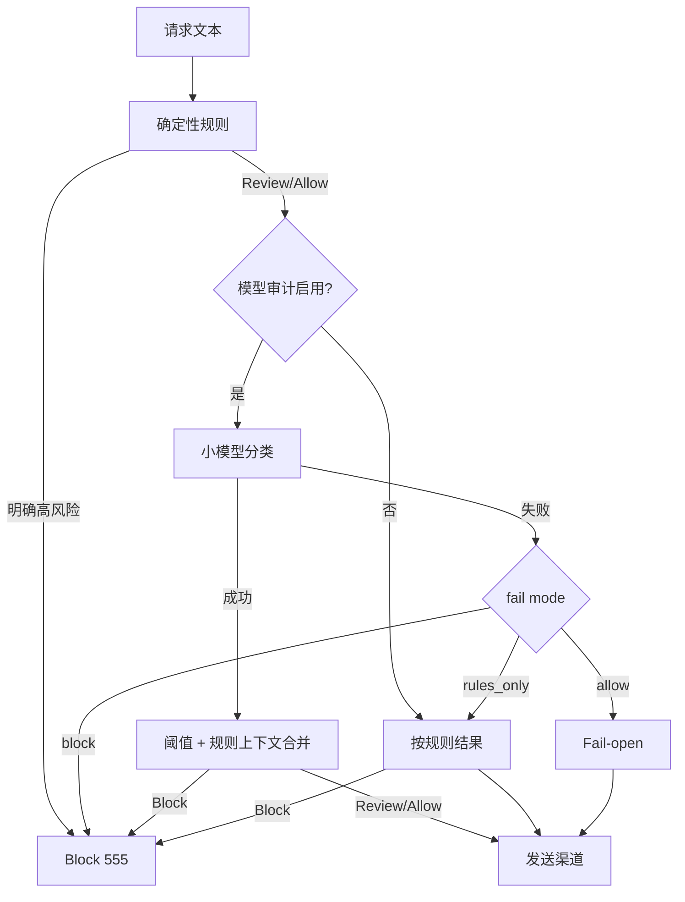

# 架构与故障模型

## 1. 请求主链

1. NewAPI 将渠道请求发送至 `/r/{route_key}/v1/*`，或使用默认路由 `/v1/*`。
2. 网关生成/接受 `X-Request-ID` 与 `traceparent`，提取模型名和文本内容。
3. Redis 分布式令牌桶按用户/Token/IP 哈希限流；Redis 不可用且非必需时退化为本机令牌桶。
4. 确定性 Cyber 规则执行。明确的操作型滥用直接阻断，不调用审计模型。
5. 其余文本请求调用 OpenAI 兼容小模型；按 block/review 阈值和失败模式作决策。
6. 网关重写模型名、认证与静态路由头，使用防 SSRF Transport 请求渠道。
7. 非流式响应先在有界内存中检查渠道错误，再返回客户端；流式响应逐行透传并检查 SSE error 事件。
8. 请求追踪写入有界异步管道；数据库写入失败会记录指标和错误。
9. 追踪数据写 PostgreSQL 热分区，并把 Kafka 事件写入同一数据库的 Outbox。
10. Outbox 工作者使用 `FOR UPDATE SKIP LOCKED` 并发领取，成功投递后标记，失败指数退避，超过上限投递死信 Topic。

## 2. 组件职责

### Gateway

无会话状态，可横向扩展。路由短缓存和运行时设置位于进程内；Redis Pub/Sub 发出失效通知，定时刷新作为兜底。

### PostgreSQL

- `routes`：渠道路由和加密后的托管密钥。
- `app_settings`：运行时风控、留存、限流与归一化设置。
- `request_traces_YYYYMMDD`：按天分区的热追踪。
- `tracking_records`：NewAPI 主动上报记录，按 `request_id` 幂等更新。
- `event_outbox`：Kafka 可靠投递队列。
- `delivery_events`：投递结果和可观测性。

分区维护器提前创建分区并删除超出热窗口的旧分区。默认窗口为 7 天。

### Redis

- Lua 原子令牌桶：跨副本共享速率状态。
- 审计结果缓存：相同模型/阈值/文本短期复用。
- 配置失效频道：路由或设置变化后通知所有副本。

Redis 不承担当作长期审计数据库。Redis 持久化只用于提升故障恢复，不改变该职责边界。

### Kafka

Topic：

- `risk.audit.events`：代理请求完成事件。
- `risk.request.traces`：NewAPI 主动追踪事件。
- `risk.deadletter`：达到重试上限或不可恢复的投递事件。

Kafka 事件含 `event_id`，消费者必须幂等。Topic 保留时间可在管理台修改；生产集群可关闭自动建 Topic，由管理员脚本创建。

## 3. 审计决策

规则是防止明显漏检的确定性底线，小模型负责上下文判断。规则集不是静态关键词黑名单：防御、已授权、取证、CTF、风险说明等上下文会降低硬拦截概率。

## 4. 错误归一化

非流式响应满足任一条件时可转为 555：

- HTTP 状态在路由/全局 `normalize_statuses` 中；
- 响应 body 包含路由/全局特征词；
- JSON 看起来是渠道错误，并包含已识别的模型不存在、过载、容量不足、上游超时等语义；
- 渠道连接、DNS、TLS、超时等 Transport 错误。

流式响应在头部发送前遇到状态错误时可返回 HTTP 555；头部发送后出现错误只能改写 SSE 事件体。

## 5. 故障矩阵

| 故障 | 请求路径 | 事件路径 | Readiness |
|---|---|---|---|
| PostgreSQL 不可用 | 现有路由缓存可能短时服务，但管理/追踪失败；建议流量摘除 | 无法持久化热数据/Outbox | 失败 |
| Redis 不可用，`REDIS_REQUIRED=false` | 单机限流、无审计缓存；多实例通知靠定时刷新 | 不受影响 | 可通过 |
| Redis 不可用，`REDIS_REQUIRED=true` | 实例启动/就绪失败 | 不受影响 | 失败 |
| Kafka 不可用 | 模型请求继续；Kafka 不在同步请求链 | Outbox 累积，恢复后续投 | 依 `KAFKA_REQUIRED` |
| 审计模型超时 | 由 `rules_only/allow/block` 决定 | 记录审计降级原因 | 可通过 |
| 渠道超时 | 返回 555，记录错误分类 | 正常写热数据/Outbox | 可通过 |
| 单个 Gateway 崩溃 | 负载均衡切到其他副本 | 未提交请求可能丢；已提交 Outbox 可恢复 | 单实例失败 |

## 6. 一致性语义

- 代理响应和追踪写入不是分布式事务；客户端收到响应后，极端进程崩溃可能导致该条热追踪缺失。
- PostgreSQL 热追踪与 Outbox 在服务处理阶段顺序写入；Kafka 为至少一次投递。
- Kafka 消费者使用 `event_id` 去重，不依赖 Topic offset 作为业务唯一性。
- `/api/v1/track` 以 `request_id` 幂等更新，适合 NewAPI 在 start/finish/error 阶段重复上报。

## 7. 容量模型

粗略容量由四个独立限制决定：

- 网关 HTTP 并发与渠道连接池；
- 审计模型最大并发 `AUDIT_MODEL_MAX_CONCURRENCY`；
- PostgreSQL 写入/分区与连接池；
- Kafka Outbox 投递吞吐。

小模型常是首个瓶颈。商业环境可部署多个审计模型副本，并在其前方放无状态负载均衡；网关 URL 指向该内部入口。对重复文本，Redis 审计缓存可明显降低模型调用量。
